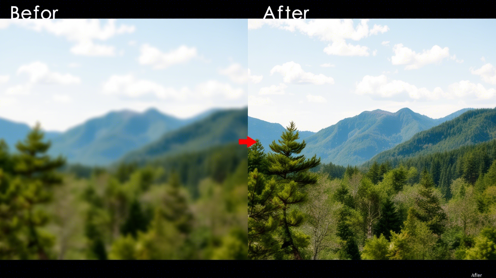

<h1 align="center">PixelGAN</h1>

  
	
	

Инструмент разработанный для улучшения качества фото и видео. В нем используется алгоритм генеративно-состязательной сети.

<h2 align="center">Установка и использование</h2>

Для начала требуется установить PyTorch с официального сайта.

<pre><code>Устанавливаем зависимости <code>pip install -r requirements.txt</code></code></pre>

Откройте (или создайте, если его нет) файл <code>.env</code> и запишите туда <code>INPUT_PATH=your_path_to_file</code>, где <code>your_path_to_file</code> это путь до вашего файла. Для удобства вы можете располагать файлы в дирректории <code>General/input</code>. Если папки <code>input</code> не существует, вы можете ее создать.

Так-же в этом файле создайте еще одну переменную <code>COLLECTION_OF_MANY_FILES=False</code>. Если значение установлено <code>False</code>, то обрабатываться будет только один файл, указанный в <code>INPUT_PATH</code>. Если же установлено значение <code>True</code>, то вместо пути до файла в переменной <code>INPUT_PATH</code> вам нужно указать путь до папки, в которой лежит множество фото/видео.

<strong>ВАЖНО:</strong> файлы принимаются только с расширениями (jpg, jpeg, png, mp4, avi, mov)

После всех действий выше вы можете запускать файл <code>app.py</code>. Результаты выполнения вы обнаружите в папке <code>General/results</code>. Если вы обрабатывали видео, в этой папке появятся отдельные кадры видео, а в самом конце файл видео с вашим названием и расширением.

<h2 align="center">Уникальность нашего проекта</h2>

Уникальность продукта обеспечивается использованием объектно-ориентированного программирования (ООП), которое позволяет структурировать код в виде взаимодействующих объектов, повышая его модульность, гибкость и упрощая разработку, тестирование и сопровождение.

Важным фактором является применение Генеративно-состязательной сети (GAN) в качестве алгоритма. GAN способна эффективно обучаться на больших объемах данных и улучшать результаты с каждой новой итерацией обучения, обеспечивая высокую точность и качество генерации изображений.

Наш продукт обладает мультифункциональностью, предоставляя возможность обработки как отдельных изображений/видео, так и целых папок.

<h2 align="center">Задачи на будущее</h2>
<ol align="center">
    <li>Подбор весов моделей для более качественной обработки видео</li>
    <li>Построение более легковесной архитектуры</li>
    <li>Добавление генеративной модели для улучшения лиц на видео</li>
    <li>Ускорение работы алгоритма</li>
    <li><strong>Непрерывное совершенствование:</strong> Постоянно обновлять и совершенствовать модель искусственного интеллекта, периодически обновляя ее новыми данными и учитывая отзывы пользователей. Быть в курсе последних исследований в области методов улучшения качества видео, чтобы внедрять любые новые подходы или достижения.</li>
</ol>

<h2 align="center">Результат работы алгоритма</h2>

<strong>До обработки | После обработки</strong>

    
    
    

<h2 align="center">Итоги Хакатона</h2>

    

<h2 align="center"> Star History</h2>

<a href="https://star-history.com/#K1rsN7/BusinessLunchGAN&Date">
 <picture>
   <source media="(prefers-color-scheme: dark)" srcset="https://api.star-history.com/svg?repos=K1rsN7/BusinessLunchGAN&type=Date&theme=dark" />
   <source media="(prefers-color-scheme: light)" srcset="https://api.star-history.com/svg?repos=K1rsN7/BusinessLunchGAN&type=Date" />
   
 </picture>
</a>

